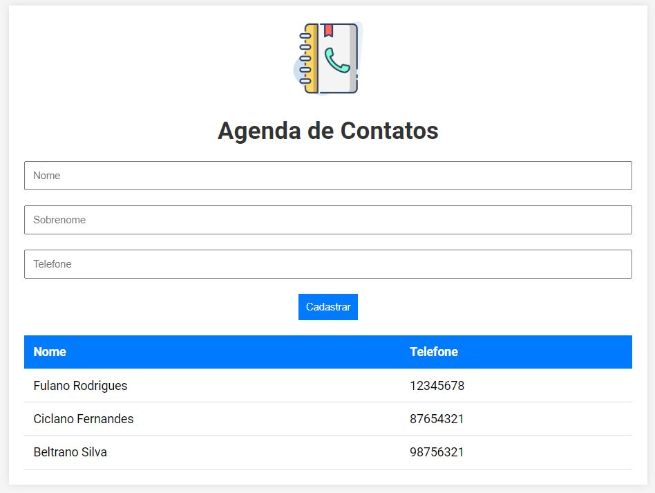

<h1 align="center">📞 Agenda Telefônica 📞</h1>

    
  

## Descrição do Projeto

O projeto foi proposto pela EBAC. É uma aplicação para inserir contatos contendo nome, sobrenome e telefone.

### [Visite o projeto](https://ebac-agenda-contatos-eight.vercel.app/)

## Tópicos do Projeto

- Inserção do nome, sobrenome e telefone através de input e botão 'cadastrar'.
- Tabela com 2 colunas e linhas incrementaveis de acordo com a quantidade de contatos cadastrados.
- Apresentação da lista de contatos.

 
<h2 align="center"> Desenvolvido por:
</h2>

<h3 align="center"> Renata Ribeiro 

</h3>
  
